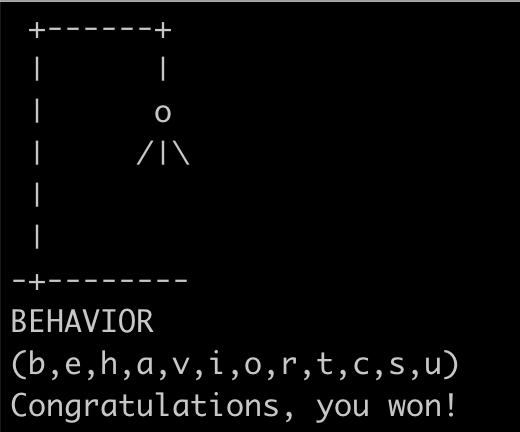

Silly little CLI Hangman game with Node.JS
===

## Install:

> npm install

Post-install script runs build.

## Build:

> npm run build

## Test:

> npm test

## Run:

> npm start

## Link (for executable):

> npm link
